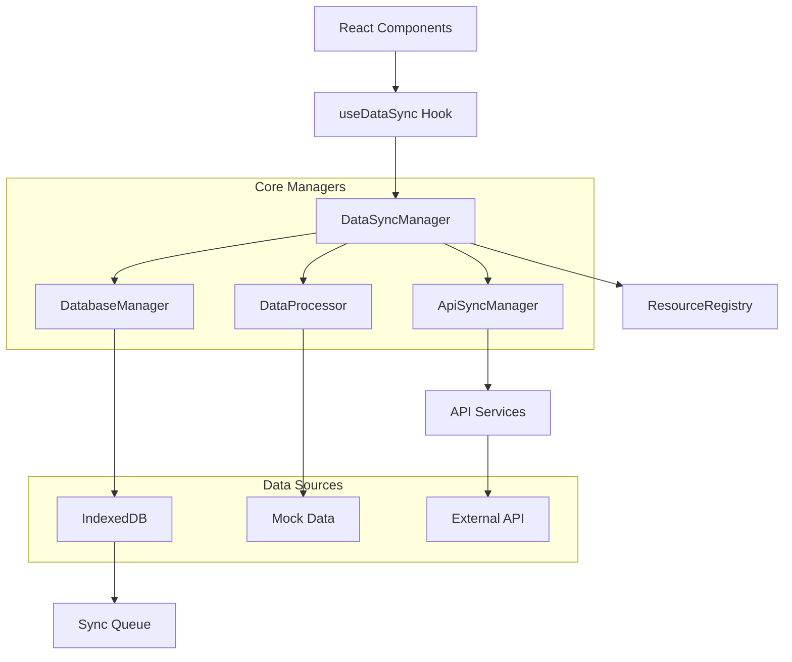
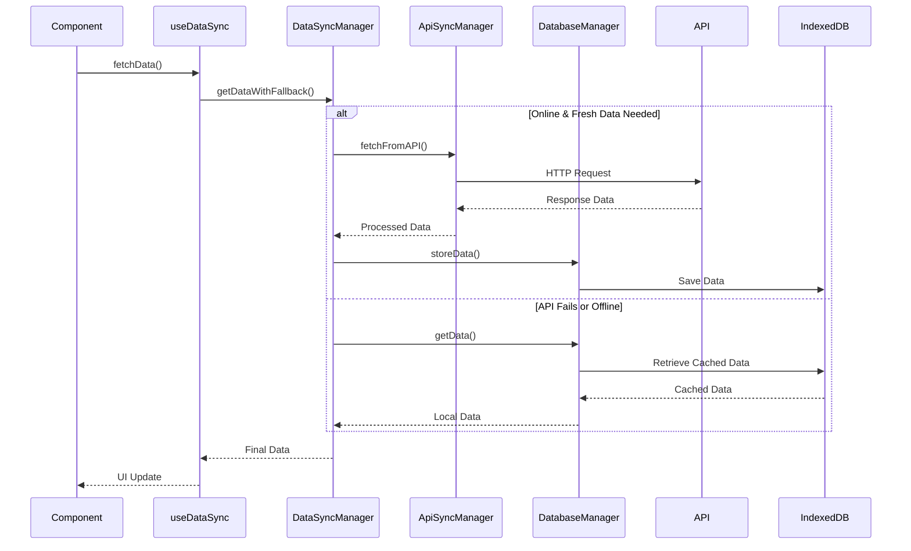
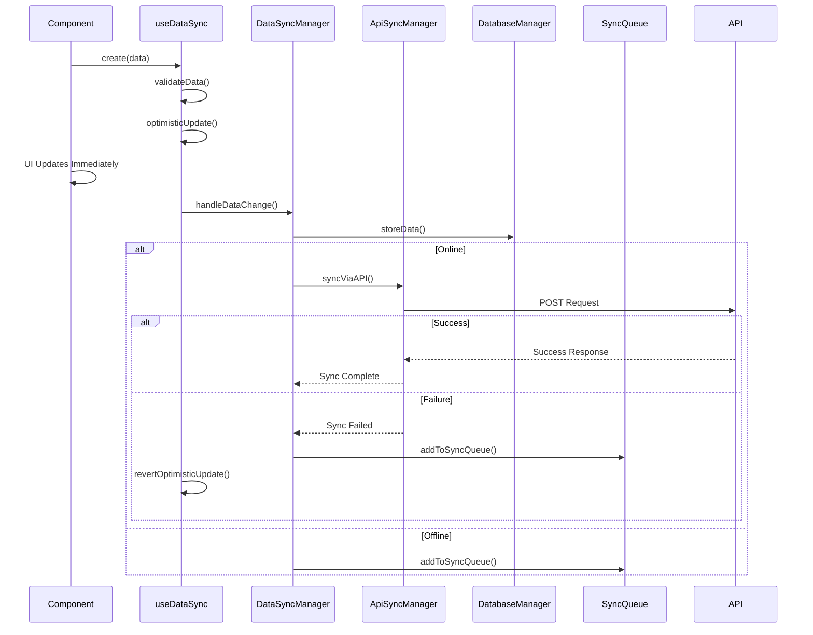
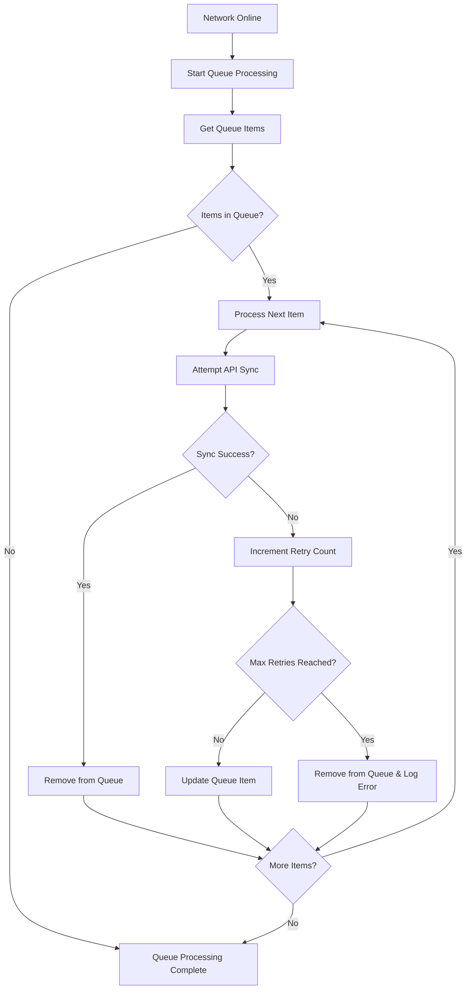

# Data Flow Architecture: API-IndexedDB-Components System

## Table of Contents
1. [System Overview](#system-overview)
2. [Architecture Components](#architecture-components)
3. [Data Flow Process](#data-flow-process)
4. [CRUD Operations Lifecycle](#crud-operations-lifecycle)
5. [Offline Queue Management](#offline-queue-management)
6. [Timeline Resource Example](#timeline-resource-example)
7. [Best Practices](#best-practices)
8. [Error Handling](#error-handling)

---

## System Overview

The data flow system provides a unified approach for managing data synchronization between API, IndexedDB, and React components. It ensures seamless offline functionality, automatic conflict resolution, and optimistic updates for the best user experience.

### Key Features
- **Server-First Approach**: Always tries API first for fresh data
- **Offline-First Fallback**: Graceful degradation to IndexedDB when API fails
- **Optimistic Updates**: Immediate UI feedback with automatic rollback on errors
- **Queue Management**: Failed operations are queued and retried when online
- **Business Type Support**: Dynamic endpoints based on business type (dental, gym, hotel)
- **Strategy Pattern**: Business-specific validation and logic

---

## Architecture Components



### Core Components

#### 1. **DataSyncManager** 
- Central orchestrator coordinating all data operations
- Manages initialization, event handling, and fallback strategies
- Handles business type configuration and data standardization

#### 2. **ResourceRegistry**
- Manages resource configurations and business-specific endpoints
- Maps resources to API endpoints with dynamic business type support
- Configures validation rules, pagination, and date range requirements

#### 3. **ApiSyncManager** 
- Handles all API communication using the unified API structure
- Manages authentication requirements and request routing
- Processes responses and emits appropriate events

#### 4. **DatabaseManager**
- Manages IndexedDB operations and schema maintenance
- Handles sync queue operations for offline functionality
- Manages data versioning and duplicate prevention

#### 5. **DataProcessor**
- Processes and transforms data between different formats
- Adds metadata for tracking sync status and data source
- Handles business-specific data standardization

---

## Data Flow Process

### 1. **Data Request Flow**



### 2. **Fallback Strategy**

The system implements a three-tier fallback strategy:

1. **Primary: API** - Fresh data from server
2. **Secondary: IndexedDB** - Cached data for offline functionality  
3. **Tertiary: Mock Data** - Development/demo data when no cache exists

---

## CRUD Operations Lifecycle

### Create Operation Example

```javascript
// Component Usage
const { create } = useDataSync('timeline', {
  businessType: 'dental',
  enableValidation: true,
  enableBusinessLogic: true
});

const handleCreateAppointment = async (appointmentData) => {
  try {
    await create(appointmentData);
    // Success handled automatically with optimistic updates
  } catch (error) {
    // Error handled automatically with rollback
    console.error('Failed to create appointment:', error);
  }
};
```

### CRUD Flow Sequence



---

## Offline Queue Management

### Queue Structure

```javascript
// Sync Queue Item Structure
{
  id: 1,
  resource: 'timeline',
  data: {
    _operation: 'create',
    businessType: 'dental',
    // ... appointment data
  },
  timestamp: '2024-01-20T10:30:00Z',
  retryCount: 0,
  maxRetries: 3
}
```

### Queue Processing



### Automatic Queue Processing

```javascript
// Queue processing triggers automatically when:
// 1. Network comes back online
window.addEventListener('online', () => {
  dataSyncManager.processSyncQueue();
});

// 2. New data changes occur while online
await dataSyncManager.handleDataChange('timeline', data);

// 3. Manual refresh operations
await timelineSync.refresh();
```

---

## Timeline Resource Example

Let's examine how the timeline resource works across different business types as a comprehensive example.

### 1. **Resource Configuration**

```javascript
// ResourceRegistry.js - Dynamic configuration based on business type
this.registerResource('timeline', {
  enableOffline: true,
  requiresAuth: true,
  forceServerFetch: true,
  requiresDateRange: true, // Requires startDate and endDate parameters
  apiEndpoints: {
    get: `/${businessType}/timeline`,     // GET /dental/timeline
    post: `/${businessType}/timeline`,    // POST /dental/timeline  
    put: `/${businessType}/timeline/:id`, // PUT /dental/timeline/123
    delete: `/${businessType}/timeline/:id` // DELETE /dental/timeline/123
  }
});
```

### 2. **Component Integration**

```javascript
// Dental Appointments Component
import { useDataSync } from '../../../../design-patterns/hooks';

const DentalAppointments = () => {
  const [startDate, setStartDate] = useState('2024-01-15');
  const [endDate, setEndDate] = useState('2024-01-21');

  // Primary data sync hook
  const timelineSync = useDataSync('timeline', {
    businessType: 'dental',
    startDate,
    endDate,
    enableValidation: true,
    enableBusinessLogic: true
  });

  // Business-specific logic hook
  const timeline = useDentalTimelineWithAPI(timelineSync.data, {
    startDate,
    endDate,
    enableValidation: true,
    enableBusinessLogic: true
  });

  const { appointments } = timeline.getAppointments();

  // Create new appointment
  const handleCreateAppointment = async (appointmentData) => {
    try {
      await timelineSync.create(appointmentData);
    } catch (error) {
      console.error('Failed to create appointment:', error);
    }
  };

  // Update existing appointment
  const handleUpdateAppointment = async (appointmentData) => {
    try {
      await timelineSync.update(appointmentData);
    } catch (error) {
      console.error('Failed to update appointment:', error);
    }
  };

  // Delete appointment
  const handleDeleteAppointment = async (appointmentData) => {
    try {
      await timelineSync.remove(appointmentData);
    } catch (error) {
      console.error('Failed to delete appointment:', error);
    }
  };

  if (timelineSync.loading) {
    return <div>Loading appointments...</div>;
  }

  return (
    <div>
      {appointments.map(appointment => (
        <AppointmentCard
          key={appointment.id}
          appointment={appointment}
          onEdit={handleUpdateAppointment}
          onDelete={handleDeleteAppointment}
        />
      ))}
      <button onClick={() => handleCreateAppointment(newAppointmentData)}>
        Add Appointment
      </button>
    </div>
  );
};
```

### 3. **Data Structure Standardization**

```javascript
// DataSyncManager.js - Standardizes timeline data for different business types
standardizeTimelineData(mockData) {
  const businessType = this.resourceRegistry?.getBusinessType();
  
  switch (businessType) {
    case 'dental':
      // Dental: { reservations: [...] } → [...]
      if (Array.isArray(mockData.reservations)) {
        return mockData.reservations;
      }
      return Array.isArray(mockData) ? mockData : [];
      
    case 'hotel':
      // Hotel: Combine reservations + occupancy
      const hotelData = [];
      if (mockData.reservations) hotelData.push(...mockData.reservations);
      if (mockData.occupancy) hotelData.push(mockData.occupancy);
      return hotelData;
      
    case 'gym':
      // Gym: Combine members + classes + occupancy  
      const gymData = [];
      if (mockData.members) gymData.push(...mockData.members);
      if (mockData.classes) gymData.push(...mockData.classes);
      if (mockData.occupancy) gymData.push(mockData.occupancy);
      return gymData;
      
    default:
      return [];
  }
}
```

### 4. **Business-Specific Data Models**

#### Dental Timeline
```javascript
// Dental appointment structure
{
  id: 1,
  treatmentId: 1,
  displayTreatment: 'Root Canal',
  color: '#1976d2',
  clientId: 2,
  clientName: 'John Doe',
  medicId: 1,
  medicName: 'Dr. Smith',
  date: '2024-01-16T10:00:00Z',
  duration: 60,
  status: 'scheduled',
  notes: 'First visit'
}
```

#### Hotel Timeline
```javascript
// Hotel booking structure
{
  id: 1,
  rooms: [{
    roomId: 102,
    startDate: '2024-06-12',
    endDate: '2024-06-14'
  }],
  client: {
    clientId: 2,
    clientName: 'Jane Smith',
    language: 'EN',
    email: 'jane@email.com',
    phone: '+1234567890'
  },
  general: {
    status: 'confirmed',
    isPaid: true,
    isConfirmed: true
  }
}
```

#### Gym Timeline
```javascript
// Gym check-in structure
{
  memberId: 1,
  memberName: 'Mike Johnson',
  serviceId: 1,
  serviceName: 'Premium',
  checkInTime: '14:00',
  checkOutTime: '16:00',
  type: 'member',
  timelineType: 'checkin'
}
```

### 5. **Error Handling and Recovery**

```javascript
// useDataSync.js - Comprehensive error handling
const performOperation = useCallback(async (operation, operationData) => {
  try {
    setLoading(true);
    setError(null);

    // Validation
    if (enableValidation) {
      const validation = validateData(operationData, resourceRef.current);
      if (!validation.isValid) {
        throw new Error(`Validation failed: ${validation.errors.join(', ')}`);
      }
    }

    // Permission check
    const operationName = `${operation}${resourceRef.current.charAt(0).toUpperCase() + resourceRef.current.slice(1)}`;
    if (!isOperationAllowed(operationName, operationData)) {
      throw new Error('Operation not allowed');
    }

    // Optimistic update
    optimisticUpdate(prevData => {
      // Update UI immediately
      return updatedData;
    });

    // Sync with API
    await dataSyncManager.handleDataChange(resourceRef.current, operationData);
    
    // Refresh to get server state
    await fetchData();

  } catch (err) {
    console.error(`Error performing ${operation}:`, err);
    setError(err);
    
    // Revert optimistic update
    await fetchData();
    
    if (onErrorRef.current) {
      onErrorRef.current(err);
    }
  } finally {
    setLoading(false);
  }
}, [/* dependencies */]);
```

---

## Best Practices

### 1. **Component Integration**

```javascript
// ✅ Good: Use the useDataSync hook for data management
const { data, loading, error, create, update, remove } = useDataSync('timeline', {
  businessType: 'dental',
  enableValidation: true,
  enableBusinessLogic: true
});

// ✅ Good: Handle loading and error states
if (loading) return <LoadingSpinner />;
if (error) return <ErrorMessage error={error} onRetry={refresh} />;

// ✅ Good: Use optimistic updates for immediate feedback
const handleSave = async (data) => {
  try {
    await create(data); // Optimistic update happens automatically
  } catch (error) {
    // Error handling and rollback is automatic
  }
};
```

### 2. **Error Handling Strategy**

```javascript
// ✅ Good: Let the system handle connectivity errors gracefully
try {
  await timelineSync.create(appointmentData);
} catch (error) {
  // Only handle business logic errors
  if (!error.message.includes('Backend indisponibil')) {
    showUserError(error.message);
  }
  // Connectivity errors are handled automatically with queue
}
```

### 3. **Business Type Configuration**

```javascript
// ✅ Good: Set business type early in the component lifecycle
useEffect(() => {
  if (businessType && dataSyncManager.businessType !== businessType) {
    dataSyncManager.setBusinessType(businessType);
  }
}, [businessType]);
```

### 4. **Resource-Specific Hooks**

```javascript
// ✅ Good: Create business-specific hooks for complex logic
export const useDentalTimelineWithAPI = (timelineData, options = {}) => {
  const appointmentsStore = useAppointmentsStore();
  
  const appointments = useMemo(() => 
    timelineData?.reservations || [], 
    [timelineData?.reservations]
  );
  
  return {
    ...appointmentsStore,
    getAppointments: () => ({
      appointments,
      displayedAppointments: appointmentsStore.getDisplayedAppointments(appointments)
    })
  };
};
```

---

## Error Handling

### Error Types and Response Strategies

| Error Type | Response Strategy | User Impact |
|------------|------------------|-------------|
| **Connectivity Error** | Queue operation, use cache | Seamless - operation appears successful |
| **Validation Error** | Show validation message | User sees specific field errors |
| **Permission Error** | Show permission denied | User informed of access restrictions |
| **Server Error** | Queue operation, show notification | User sees temporary error message |
| **Data Conflict** | Show merge interface | User resolves conflicts manually |

### Automatic Recovery Mechanisms

1. **Queue Retry Logic**: Failed operations retry automatically with exponential backoff
2. **Cache Fallback**: When API fails, system transparently uses cached data
3. **Optimistic Rollback**: Failed operations revert UI state automatically
4. **Connection Recovery**: Queue processes automatically when network returns

---

## Summary

This data flow architecture provides:

- **Seamless Offline Experience**: Users can work offline with automatic sync when online
- **Optimistic Updates**: Immediate UI feedback with automatic error recovery
- **Business Type Flexibility**: Dynamic endpoints and validation based on business type
- **Robust Error Handling**: Comprehensive error management with user-friendly fallbacks
- **Developer-Friendly API**: Simple hooks that handle complex synchronization logic

The system ensures data consistency while providing the best possible user experience across all network conditions and business types. 